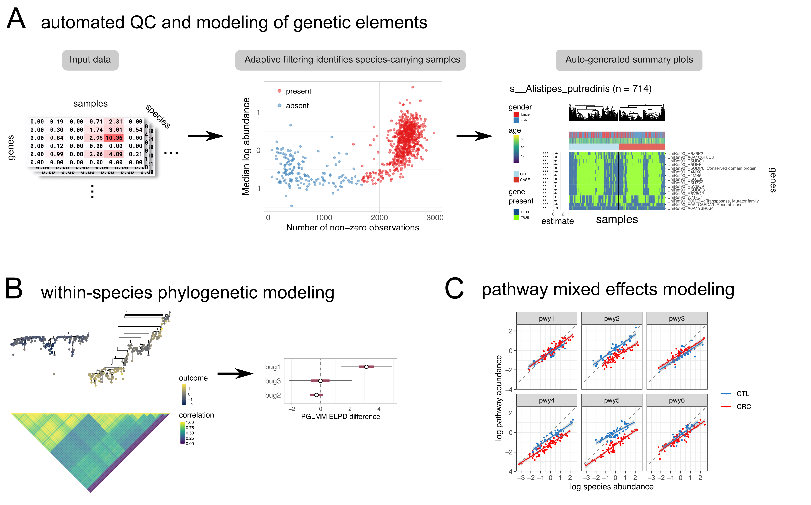

<!-- README.md is generated from README.Rmd. Please edit that file -->

```{r, include = FALSE}
knitr::opts_chunk$set(
  collapse = TRUE,
  comment = "#>",
  fig.path = "man/figures/README-",
  out.width = "100%"
)
```

# anpan 

<!-- badges: start -->
<!-- badges: end -->

The goal of anpan is to consolidate statistical methods for strain analysis. This includes automated filtering of metagenomic functional profiles, testing genetic elements for association with outcomes, phylogenetic association testing, and pathway-level random effects models.

```{r out.width="90%", out.height="90%", echo = FALSE}

```


## Dependencies

anpan depends on R ≥4.1.0 and the following R packages, most of which are available through CRAN (the exception being cmdstanr):

```{r eval = FALSE}
install.packages(c("ape", 
                   "data.table", 
                   "devtools",
                   "dplyr", 
                   "fastglm",
                   "furrr", 
                   "ggdendro",
                   "ggnewscale",
                   "ggplot2",
                   "loo",
                   "patchwork",
                   "phylogram",
                   "posterior",
                   "progressr",
                   "purrr", 
                   "R.utils",
                   "stringr",
                   "tibble",
                   "tidyselect")) # add Ncpus = 4 to go faster

install.packages("cmdstanr", repos = c("https://mc-stan.org/r-packages/", getOption("repos")))
```

If the `cmdstanr` installation doesn't work you can find more detailed instructions [at this link](https://mc-stan.org/cmdstanr/). 

Once you've installed `cmdstanr`, you will need to use it to install CmdStan itself:

```{r eval = FALSE}
library(cmdstanr)
check_cmdstan_toolchain()
install_cmdstan(cores = 2)
```

On some servers it may also be necessary to install / load the GNU MPFR library prior to installing CmdStan.

## Installation

Once you have the dependencies, you can install anpan from github with:

```{r, eval = FALSE}
devtools::install_github("biobakery/anpan")
```

If you would like to read the walkthrough vignette, you will need to set `build_vignettes = TRUE` in the `install_github()` command. Once it's installed, you can view the vignette with `vignette("anpan_tutorial", package = 'anpan')`. There is also a static (and probably out-of-date) version of the tutorial available on [the biobakery wiki GitHub page](https://github.com/biobakery/biobakery/wiki/anpan-tutorial).

## Example - element testing

You can filter large microbial gene profiles and look for associations with outcomes (while controlling for covariates) with `anpan_batch()`: 

```{r example, eval=FALSE}
library(anpan)

anpan_batch(bug_dir           = "/path/to/functional_profiles/",
            meta_file         = "/path/to/metadata.tsv",
            out_dir           = "/path/to/output",
            annotation_file   = "/path/to/annotation.tsv", #optional, used for plots
            filtering_method  = "kmeans",
            model_type        = "fastglm",
            covariates        = c("age", "gender"),
            outcome           = "crc",
            plot_ext          = "pdf",
            save_filter_stats = TRUE)
```
This will run an anpan batch analysis for each functional profile present in `bug_dir` (there should be one input file per bug). This will run the adaptive filtering and functional modeling for the genes in each bug. The outputs will include the filter statistics, filter diagnostic plots, model statistics, and results plots for each bug.

## Example - phylogenetic generalized linear mixed model

You can run a PGLMM with the `anpan_pglmm()` function. This type of model assesses the degree to which the phylogenetic structure within a species associates with the outcome. It uses integrated leave-one-out cross-validation to compare predictive performance against the "base" GLM (without phylogenetic information).

```{r example2, eval=FALSE}
meta_file = "/path/to/metadata.tsv" 
tree_file = "/path/to/file.tre"

anpan_pglmm(meta_file,
            tree_file,
            outcome = "response")
```

There is a corresponding `anpan_pglmm_batch()` function that can be pointed to a directory of tree files with the `tree_dir` parameter.

## Example - pathway random effects model

Using pathway and species abundance profiles, you can fit a pathway-level random effects model of the form `log10(pwy_abd) ~ log10(species_abd) + (1 | pwy) + (0 + group | pwy)` with `anpan_pwy_ranef()`. This assesses how well a binary `group` variable explains variation in pathway abundance.

```{r example3, eval = FALSE}
anpan_pwy_ranef(bug_pwy_dat,
                group_ind = "group01")
```

Detailed explanation and interpretation of all three model types can be found in the vignette `vignette("anpan_tutorial", package = 'anpan')`. 

## FAQ

> I'm having installation issues, what's wrong?

There's more to the installation than the `install_github()` command. Please ensure that you've read the [Installation] section fully. The relatively unusual installation steps are:

* Installing `cmdstanr` from the Stan website
* Using `cmdstanr` to install CmdStan

> I have questions, where can I get help?

You can ask on the biobakery help forum: [https://forum.biobakery.org/](https://forum.biobakery.org/)

> What's with the name?

* The name "anpan" was chosen to fit into the [biobakery](https://huttenhower.sph.harvard.edu/tools/) bread theme and because it's short and easy to pronounce and remember. 
* [Real anpan](https://duckduckgo.com/?q=anpan&t=h_&iax=images&ia=images) are good.
* The current frontrunner backronym is "ANalysis of microbial Phylogenies And geNes" (credit to Meg Short).
* Capitalization of the name follows [the xkcd rule](https://xkcd.com/about/). All lowercase "anpan" is preferred, and all uppercase "ANPAN" is acceptable in formal contexts or the start of a sentence, but mixed-case "Anpan" should be avoided.


