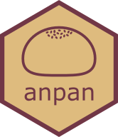

<!-- README.md is generated from README.Rmd. Please edit that file -->

```{r, include = FALSE}
knitr::opts_chunk$set(
  collapse = TRUE,
  comment = "#>",
  fig.path = "man/figures/README-",
  out.width = "100%"
)
```

# anpan 

<!-- badges: start -->
<!-- badges: end -->

The goal of anpan is to consolidate statistical methods for strain analysis. This includes automated filtering of metagenomic functional profiles, testing genetic elements for association with outcomes, and phylogenetic association testing.

## Dependencies

anpan depends on the following R packages, most of which are available through CRAN (the exception being cmdstanr):

```
install.packages(c("ape", 
                   "broom",
                   "data.table", 
                   "devtools",
                   "dplyr", 
                   "fastglm",
                   "furrr", 
                   "ggdendro",
                   "ggnewscale",
                   "ggplot2",
                   "loo",
                   "patchwork",
                   "phylogram",
                   "posterior",
                   "progressr",
                   "purrr", 
                   "R.utils",
                   "stringr",
                   "tibble", 
                   "tidyr",
                   "tidyselect")) # add Ncpus = 4 to go faster

install.packages("cmdstanr", repos = c("https://mc-stan.org/r-packages/", getOption("repos")))
```

If the `cmdstanr` installation doesn't work you can find more detailed instructions [at this link](https://mc-stan.org/cmdstanr/). Once you've installed `cmdstanr`, you will need to use it to install CmdStan:

```
library(cmdstanr)
check_cmdstan_toolchain()
install_cmdstan(cores = 2)
```

## Installation

Once you have the dependencies, you can install anpan from github with:

```{r, eval = FALSE}
devtools::install_github("biobakery/anpan")
```

If you would like to read the walkthrough vignette, you will need to set the `build_vignettes = TRUE` argument in the `install_github()` command, at which point you can view the vignette with `vignette("anpan_tutorial", package = 'anpan')`. There is also a static version of the tutorial available on [the biobakery wiki GitHub page](https://github.com/biobakery/biobakery/wiki/anpan-tutorial).

## Example - element testing

You can filter large uniref tables and look for associations with outcomes (while controlling for covariates) with `anpan_batch`. 

```{r example, eval=FALSE}
library(anpan)

anpan_batch(bug_dir = "/path/to/gene_families/",
            meta_file = "/path/to/metadata.tsv",
            out_dir = "/path/to/output",
            annotation_file = "/path/to/annotation.tsv", #optional, used for plots
            filtering_method = "kmeans",
            model_type = "fastglm",
            covariates = c("age", "gender"),
            outcome = "crc",
            plot_ext = "pdf",
            save_filter_stats = TRUE)
```
This will run an anpan batch analysis for each functional profile present in `bug_dir` (there should be one input file per bug). For each bug, `anpan`: 

1) reads in the metadata (containing the specified outcome and covariates) and the functional profile 
2) applies adaptive filtering to discard samples where the species was likely not present (based on low abundance and few non-zero observations) based on the sample's functional profile.
3) fits a model to the filtered data:
    * `model_type = "fastglm"` or `model_type = "glm"` will fit regressions to each gene in the input file separately (using the specified outcome distribution), then apply FDR correction to the p-values associated with each gene's presence. The regression for each individual gene follows the form: `outcome ~ covariate1 + covariate2 + ... + gene_presence`
    * `model_type = "horseshoe"` fits a single regression model with the specified outcome distribution, weak priors on the specified covariates, and a [regularized horseshoe prior](https://paul-buerkner.github.io/brms/reference/horseshoe.html) on the presence/absence of all genes associated with the bug. The regression follows the form: `outcome ~ covariate1 + covariate2 + ... + gene1_presence + gene2_presence + gene3_presence + ...` including all of the specified covariates and (typically thousands of) genes detected in the bug.
4) then writes results to the output directory, including tables of regression coefficients, per-bug plots of the top hits, and filter statistics.

## Example - phylogenetic generalized linear mixed model

You can run a PGLMM with the `anpan_pglmm` function. This fits a model where the covariance matrix of outcomes is determined from the phylogenetic tree. Right now the only usable outcome distributions are `family = "gaussian"` and `family = "binomial"`. If `family = "gaussian"`, the `reg_noise` parameter can be used to regularize the ratio of the noise parameters with the following prior distribution: $(\sigma_{phylo} / \sigma_{resid}) \sim Gamma(1,2)$

```{r eval=FALSE}
meta_file = "/path/to/metadata.tsv" 
tree_file = "/path/to/file.tre"

anpan_pglmm(meta_file,
            tree_file,
            trim_pattern = "_bowtie2",
            covariates = NULL,
            plot_cov_mat = TRUE,
            outcome = "age",
            verbose = TRUE,
            cores = 4)
```

There is a corresponding `anpan_pglmm_batch()` function that can be pointed to a directory of .tree files with the `tree_dir` parameter.

## FAQ

> I have questions, where can I get help?

You can ask on the biobakery help forum: [https://forum.biobakery.org/](https://forum.biobakery.org/)

> What's with the name?

* The name "anpan" was chosen to fit into the [biobakery](https://huttenhower.sph.harvard.edu/tools/) bread theme and because it's short and easy to pronounce and remember. 
* [Real anpan](https://duckduckgo.com/?q=anpan&t=h_&iax=images&ia=images) are good.
* There's no backronym, but if you think of a good one let me know.
* Capitalization of the name follows [the xkcd rule](https://xkcd.com/about/). All lowercase "anpan" is preferred, and all uppercase "ANPAN" is acceptable in formal contexts or the start of a sentence, but mixed-case "Anpan" should be avoided.


