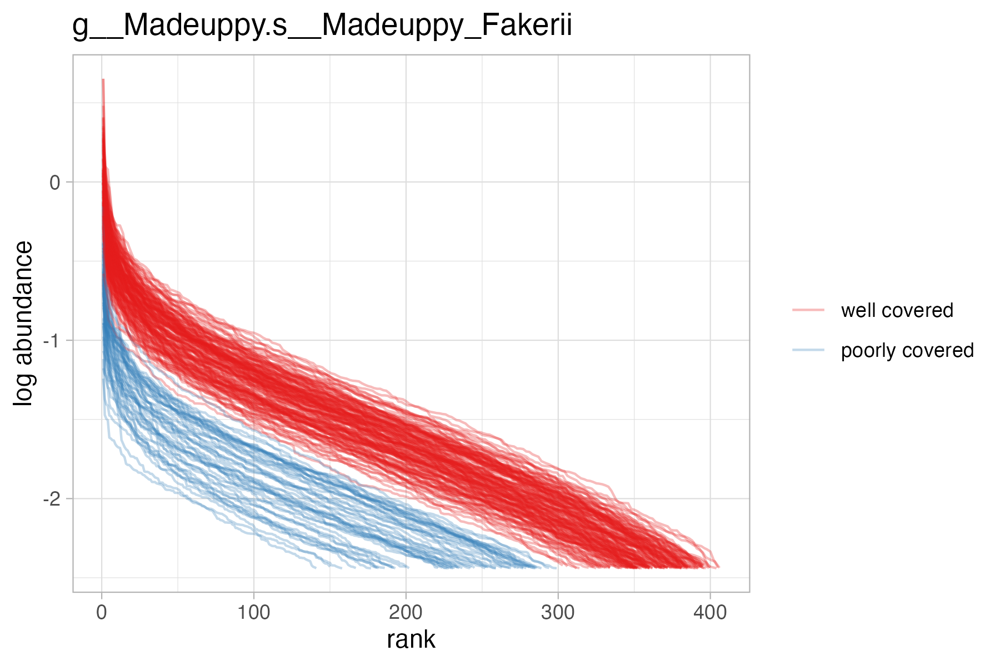
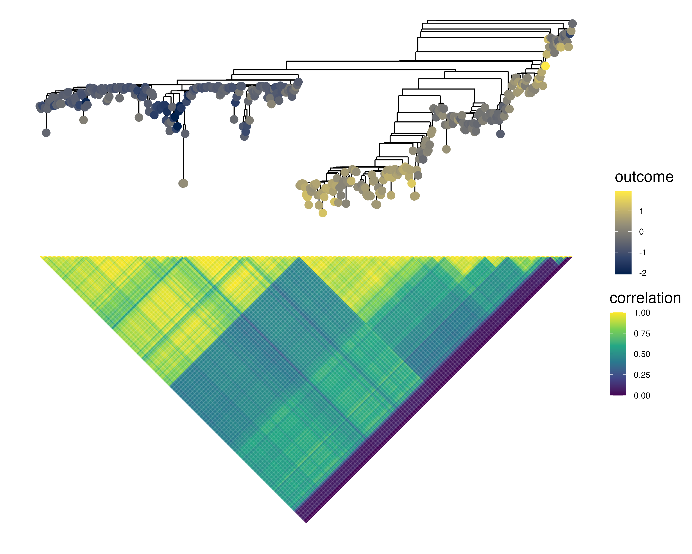
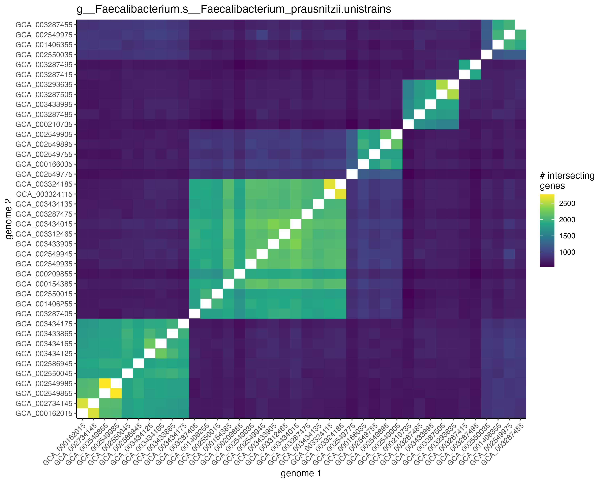

```{r, include = FALSE}
knitr::opts_chunk$set(
  collapse = TRUE,
  comment = "#>"
)
```

<style type="text/css">

body{ /* Normal  */
      font-size: 12px;
  }
td {  /* Table  */
  font-size: 8px;
}
h1.title {
  font-size: 38px;
}
h1 { /* Header 1 */
  font-size: 28px;
}
h2 { /* Header 2 */
    font-size: 22px;
}
h3 { /* Header 3 */
  font-size: 18px;
}
</style>

<!-- https://stackoverflow.com/questions/30446905/rmarkdown-font-size-and-header -->

# Introduction

It's difficult to find associations between microbial strains and host health outcomes due to their fine resolution and non-recurrence across individuals. This package, `anpan`, aims to make inferring those relationships a bit easier by providing an interface to our strain analysis functionality. This functionality covers three main points:

* Modeling the association between outcome variables and microbial gene presence while accounting for covariates
  * Including adaptive sample filtering of per-bug microbial gene profiles to identify and discard samples in which the bug is poorly covered
* Modeling the association between outcome variables and the phylogeny of strains within a given microbial species
* Modeling the difference in microbial pathways between experimental groups while controlling for species abundance.

We'll cover each of these points in a top-level section. There is also an [Advanced topics] section with some additional information on a handful of more complicated diagnostics/methods/techniques.

# Libraries

If you need installation instructions, please see [the readme on Github](https://github.com/biobakery/anpan#dependencies). 

We'll start by loading the library in this code chunk:

```{r}
library(anpan)
```

The startup message points out that you can easily parallelize / show progress bars for most long-running computations in `anpan` by setting `plan()` and `handlers()` after loading the `furrr` and `progressr` packages. For most users `plan(multisession, workers = 4)` and `handlers(global = TRUE)` are probably close to what you want, though both the [parallelization strategy](https://future.futureverse.org/reference/plan.html) and [progress reporting](https://progressr.futureverse.org/articles/progressr-intro.html#customizing-how-progress-is-reported) are highly customizable.

A couple points to know about anpan function names:

* All of the modeling functions in anpan are prefixed with `anpan_`, so if you type that into the RStudio console the auto-complete prompt should show a list of all the modeling functions. This can help you find the function you need quickly without having to dig through the documentation.
* Plotting functions are prefixed with `plot_`. 
* Several modeling functions have a `_batch()` version, which applies a given model to each bug present in a user-specified input directory.

This code chunk loads some other packages we'll use:

```{r message = FALSE, warning=FALSE, class.source = "fold-show"}
library(data.table)
library(ggplot2)
library(tibble)
library(dplyr)
library(ape)
```

# Gene model

The gene model uses microbial functional profiles and sample metadata to identify which genes in which bugs best explain sample outcome variables, while accounting for additional covariates like age and gender. The functional profiles are typically generated by [HUMAnN](https://huttenhower.sph.harvard.edu/humann). Rows are genes, samples are columns. 

There are two key problems here:

* Not all bugs have their genes detectable in all samples
* When there are enough samples that have a given bug's genes in them, finding the genes that associate with the outcome is a needle-in-a-haystack situation.

The gene model (implemented in the function `anpan()`) handles these issues respectively by:

* applying adaptive sample filtering to classify samples as having the bug's genes "well covered" or "poorly covered", so that the modeling can be run only using samples where there is data that can speak to the inferential goal
* applying logistic regression models that use either FDR correction or a horseshoe prior to pick out the small number of "hit" genes that associate with the outcome

In this section, you'll get some example data (either by reading the data included with the package or by simulating it yourself), run both steps with a single call to `anpan()` (or `anpan_batch()`), examine the filtering diagnostics, then examine the model results.

## Get example data

In this section we'll obtain a small simulated dataset for a single bug. If you have your own data or would like to use the example data built into the package, you can skip this section and go straight to [Run the gene model]. If not, the next sub-section will show how to simulate the data from scratch. You can get the paths to the data included with the package with these two commands:

```{r eval = TRUE}
meta_path = system.file("extdata", "fake_metadata.tsv", 
                        package = "anpan", mustWork = TRUE)

bug_path  = system.file("extdata", "g__Madeuppy.s__Madeuppy_Fakerii.genefamilies.tsv.gz", 
                        package = "anpan", mustWork = TRUE)
```

### Simulate example data

This section simulates some data for 200 samples in a synthetic bug with 500 genes. The simulation doesn't look realistically noisy (see the plots in the README / manuscript for that), but it incorporates the generative features anpan aims to pick up on.

First we set some of the simulation parameters and a random seed:

```{r eval = FALSE}
n_per_group = 100
n_gene      = 500

out_dir = tempdir()

set.seed(123)
```

Then we generate the simulated metadata. The `has_bug` column is an indicator if a given sample has the bug at all. Roughly a quarter of our samples don't. Of course you won't have this indicator in real data -- this is what the adaptive filtering step tries to figure out.

```{r eval = FALSE}
sim_meta = data.table(sample_id = paste0('sample_', 1:(2 * n_per_group)),
                      is_case   = rep(c(FALSE, TRUE), 
                                      each = n_per_group),
                      has_bug   = sample(x       = c(TRUE, FALSE),
                                         prob    = c(.75, .25), 
                                         size    = 2 * n_per_group,
                                         replace = TRUE))

meta_path = file.path(out_dir, "fake_metadata.tsv")

fwrite(sim_meta,
       file = meta_path,
       sep = "\t")
```

We simulate the gene-level data in the blocks below. A couple notes on what's going on here:

* we set the first five genes to have a non-zero true effect
* the bug and gene abundances are modeled on the log scale 
* the log abundances (`labd`) come from a left-skewed normal distribution, which we define in the function `rskewnormal` (adapted from the [`sn` package](https://cran.r-project.org/web/packages/sn/index.html))
* gene log-abundances below the 33rd percentile are truncated to -Inf i.e. are zeroed out.

First we create the simulated metadata: 
```{r eval = FALSE}
true_effects = data.table(gene   = paste0("UniRef90_ABC", 1:(n_gene)),
                          effect = c(rnorm(5, sd = 2), 
                                     rep(0, (n_gene - 5))))

sim_grid = expand.grid(gene      = paste0("UniRef90_ABC", 1:(n_gene)),
                       sample_id = paste0(     "sample_", 1:(2*n_per_group))) |>
  as.data.table()
```

Then we simulate the log-abundances. A couple notes on how this is done:

* If a sample doesn't have a bug present, it drops the bug abundance. 
* Gene log-abundance is proportional to bug abundance and in cases, the true effect of the gene (which really flips the causal direction implied by the gene model, but for a simulation this simple it doesn't matter).
* most of the coefficients used here are magic numbers chosen to get the values roughly near realistic ranges

```{r eval = FALSE}
rskewnormal = function(n, location = 0, scale = 1, skew = 0) {
  # adapted from sn::rsn()
  
  delta = skew / sqrt(1 + skew^2)
  chi   = abs(rnorm(n))
  nrv   = rnorm(n)
  
  z = delta * chi + sqrt(1 - delta^2) * nrv

  return(location + scale * z)
}

sim_meta[, bug_labd := rskewnormal(n        = nrow(sim_meta),
                                   location = -2,
                                   skew     = -3) +
                       -2.5 * (!has_bug)]

sim_df = sim_grid[sim_meta, on = 'sample_id'][true_effects, on = 'gene']

sim_df[, gene_labd := rskewnormal(n        = nrow(sim_df),
                                  location = -1 + 0.5 * bug_labd + is_case * effect,
                                  skew     = -3,
                                  scale    = 3)]

sim_df$gene_labd[sim_df$gene_labd < quantile(sim_df$gene_labd,
                                             probs = .333)] = -Inf
```

The block below performs a bit of formatting to make the simulated data look like real [HUMAnN](https://huttenhower.sph.harvard.edu/humann) data. It:

* exponentiates the log-abundances
* pivots to wide format
* adds on the fake species identifier to the gene column
* and renames to the gene column to `# Gene Family`

```{r eval = FALSE}
sim_df[, gene_abd := exp(gene_labd)]

sim_wide = dcast(sim_df[, .(gene, sample_id, gene_abd)],
                 gene ~ sample_id,
                 value.var = "gene_abd")

sim_wide[, gene := paste0(gene, "|g__Madeuppy.s__Madeuppy_Fakerii")]

names(sim_wide)[1] = "# Gene Family"
```

Then we write out the simulated data. The name of the file isn't important, but here we've chosen to follow the naming conventions of [HUMAnN](https://huttenhower.sph.harvard.edu/humann).

```{r eval = FALSE}
bug_path = file.path(out_dir, "g__Madeuppy.s__Madeuppy_Fakerii.genefamilies.tsv.gz")

fwrite(sim_wide,
       file = bug_path,
       sep  = "\t")
```

Let's take a peek at the top of the metadata and the top-left corner of the gene profile data to see what they look like:

```{r}
fread(meta_path, nrows = 5)
```

Notably, the metadata needs to have a column called "sample_id" that matches the column names of the gene file and any outcome / covariate information we might use. Later we will be using only `is_case` as the outcome and no additional covariates, but you might as want to include age, gender, etc. in which case they need to be present in this file.

Now let's look at the gene data:

```{r}
fread(bug_path, nrows = 5, select = 1:4)
```

The gene file needs to have gene IDs in the first column, formatted as `gene_id|taxon_id` e.g. `UniRef90_ABC000001|g__Madeuppy.s__Madeuppy_Fakerii`. The names of the remaining columns need to exactly match the entries in the `sample_id` column of the metadata. 

## Run the gene model

Now that we have the path to the gene data set in `bug_path` and the path to the metadata set in  `meta_path`, we can run the filtering and modeling with `anpan()`. If you have multiple bug files in a single directory, use `anpan_batch()` instead and set the `bug_dir` argument instead of `bug_file`. 

The code block below shows the `anpan()` function call. The outcome argument is set to `is_case` the logical indicator of case status (which means that `anpan()` will be running a logistic regression model). Note that this means anpan will be running logistic regression models for each gene. In this case, we have no covariates to include, so we set that argument to `NULL`. The output directory is set to a sub-directory of the tempdir() we've been using so far, but it could be somewhere more permanent if you like.  

```{r}
anpan_res = anpan(bug_file          = bug_path,
                  meta_file         = meta_path,
                  out_dir           = file.path(tempdir(), "anpan_output"),
                  covariates        = NULL,
                  outcome           = "is_case",
                  model_type        = "fastglm",
                  discretize_inputs = TRUE)
```

You can see from the first set of messages that it seems to have identified most of the ~50 samples that didn't have the bug present in the simulation.

A lot of stuff gets written out to `out_dir`, but let's look at the result that we get in R:

```{r}
head(anpan_res)
```

`anpan()` returns a data.table with regression statistics for the effect of each gene on the outcome. We can see that the two top-ranked hits (and the only two that pass a reasonable q-value threshold) are the strongest genes from the list of true effects. We don't get the second through fourth genes with (weaker) true effects, meaning we likely didn't have enough power in this simulation to detect those. The regression statistics for all terms in the model (including non-gene covariate terms) are written to the output directory in `*all_terms.tsv.gz`. The stats for just the gene terms (i.e. the same data frame returned by `anpan()` in R) is written to `*gene_terms.tsv.gz`.

## Examine filtering diagnostics

Before interpreting the model results, it's important to ensure that the filtering step didn't go awry. `anpan()` calls the function `read_and_filter()` internally, which applies:

* an initial prevalence filter to genes (must be >5 & <(N-5) positives per group for the gene)
* a sample filter to remove samples where the species in question is poorly covered
* and then a final prevalence filter to remove any marginal genes that became almost constant during the sample filter 

The outputs of the filtering step goes into the `filter_stats/` directory inside the specified `out_dir`. The final filtered data (which is the input to the modeling step) is in `filter_stats/filtered_*.tsv.gz` where * represents the bug name. The `filter_stats/labels/` directory contains the calls of which samples contained the bug. The `filter_stats/plots/` directory contains diagnostic plots from the filtering step. For a given bug, there are two plots to inspect: the gene profile lines plot and the k-means filtering dot plot. We'll look at the dot plot first:

```{r eval = TRUE, echo = FALSE}
knitr::include_graphics("vignette_figs/g__Madeuppy.s__Madeuppy_Fakerii_kmeans.png") #show lines and kmeans plots
```

Recall the original input file: genes are rows and columns are samples. Here, each dot represents a sample, meaning a column in the original input. The x axis is the number of non-zero entries in that column, and the y axis is the median log abundance of the non-zero entries. Meaning if a sample has many non-zero entries and high median log abundance, the bug in question is probably well-covered in the sample. A simple k-means clustering is applied to the dots on this scatterplot, which is used to define the presence/absence calls (i.e. provide the coloring of the dots). In this particular example, only two samples are misclassified. If the dot plot doesn't show two well separated populations, it might make sense to do some initial manual curation of the data as appropriate and then set `filtering_method = "none"` when calling anpan() to turn off the kmeans filtering.

Next we'll look at the gene profile lines plot:

```{r eval = TRUE, echo = FALSE}
 #show lines and kmeans plots
```

This shows a monotonic decreasing line for each sample. The x-axis is the rank of genes in that sample, while the y-axis is the log-abundance value of the ith-ranked gene in that sample. Ideally there should be good separation between red and blue lines. In this simulated data they seem to decrease linearly, but in more realistic data it usually looks more like a plateau. If a particular sample contains a mixture of strains, there may even be multiple plateau steps as the profile decreases, representing different groups of genes dropping out between strains.  

If the two groups of samples identified by the filtering step aren't clearly separated, that's cause for concern. That means you're potentially throwing out or including samples you shouldn't. If the automated filtering doesn't work out, you can filter your samples manually on your own then turn off the automated filtering with `filtering_method = "none"`.

## Examine gene model results

We can visualize the results with `plot_results()` as in the code block below. This function is called automatically on each bug when using `anpan_batch()`. We first read in the model inputs from the `filter_stats` directory, then pass that and the model results to `plot_results()`:

```{r eval = TRUE}
input_path = file.path(tempdir(), 
                       "anpan_output", "filter_stats",
                       "filtered_g__Madeuppy.s__Madeuppy_Fakerii.tsv.gz")

model_input = fread(input_path)

plot_results(res         = anpan_res,
             model_input = model_input,
             covariates  = NULL, 
             outcome     = "is_case",
             bug_name    = "Madeuppy_Fakerii",
             cluster     = "both",
             show_trees  = TRUE)
```

Things to know about the results plot: 

* The central blue/green tile plot shows the model inputs i.e. which genes (rows) are present in which samples (columns). 
* The annotation bar at the top shows the outcome variable
  * The color bars at the top can also show up to two additional covariates.
* the estimate intervals on the left show the coefficient estimates +/- 1.96 * standard error bars and nominal significance stars
  * In this case, you can see that really only the top two rows are obviously different between the two groups, despite the nominal significance stars on the lower rows. 
* The genes are sorted by significance by default, but they and/or the samples may be clustered by setting `cluster = "samples"` or `"genes"` or `"both"`. 
  * In this case, because we didn't incorporate any linkage of genes or relatedness of samples, we don't get any interesting clustring structure. 
* The plot shows the top 50 genes by default, but you can set the `n_top` or `q_threshold` arguments to override this behavior.

Some additional outputs you'll get with `anpan_batch()`:

* with `model_type = "fastglm"` you'll get a global p-value histogram as a diagnostic for the performance of the regressions. You can learn how to interpret p-value histograms [here](http://varianceexplained.org/statistics/interpreting-pvalue-histogram/). Basically, you should expect/hope to get a mostly uniform distribution with a spike on the left.
* a `warnings.txt` file listing any warnings that occurred
* a `anpan_batch_call.txt` listing the command that was issued to `anpan_batch()`


# PGLMMs

Phylogenetic generalized linear mixed models (PGLMMs) are probabilistic models that account for phylogenetic structure. For a PGLMM with a linear regression as the base model, the model structure is as follows:

$$ y = X \beta + (1|\text{leaf}) + \epsilon $$
            
$$(1|\text{leaf}) \sim \text{MVNormal}(0, σ_p^2\Omega)$$

$$\epsilon \sim \text{Normal}(0, σ_R^2)$$

The outcome $y$ is modeled as a function of some familiar terms: covariates $X$, coefficients $\beta$, and residual noise $\epsilon$. The key addition is the phylogenetic term $(1|\text{leaf})$, which contains a "random effect" for each observation in $y$. Unlike typical random effects (which are usually independent between different levels of the random effect variable), the values in the phylogenetic term follow a pre-specified correlation structure $\Omega$, which is derived from a tree. The variability of the phylogenetic term is scaled by the "phylogenetic noise" parameter $\sigma_{phylo}$.

To understand how a tree implies a correlation structure, consider the plot below showing a phylogenetic tree and the lower triangle of the correlation matrix it implies. You can see that the clade on the left (with low inter-leaf distances between its members) forms a bright sub-block of high correlation in the matrix. The tiny clade on the far right has high inter-leaf distance between its members and the rest of the tree, so its members generally have low correlation with the rest of the leaves, exhibited by the dark band on the right of the triangle. Note that the matrix is derived solely from the structure of the tree (the black lines) -- it is not influenced by the colored outcome dots. The correlation matrix numerically quantifies the "higher inter-leaf distance → lower correlation" principle.

```{r echo=FALSE}

```

We can see in the synthetic example above that the tree clearly does impact the outcome: the two well-separated clades clearly show very different outcome values. A PGLMM evaluated on this data would easily detect such a blazing signal, so in the remainder of this section we'll simulate a tree with an outcome that's realistically noisier and less visually obvious. After that we'll fit the PGLMM with `anpan_pglmm()` then examine the results.

## Simulate data

To demonstrate the PGLMM functionality, we'll simulate a tree, a single covariate `x`, and an outcome variable `y`. We'll use `n = 120`, `sigma_phylo = 1` and `sigma_resid = 1`. 

The code chunk below sets a randomization seed and the parameters we'll use, then generates a random tree:

```{r eval = TRUE}
set.seed(123)

n = 120
sigma_phylo = 1
sigma_resid = 1

tr = ape::rtree(n)
```

You can try `plot(tr)` if you want to take a quick look at your tree, but we'll examine it with some additional detail later.

The chunk below derives the correlation matrix implied by the tree:
```{r}
cor_mat = ape::vcv.phylo(tr, corr = TRUE)

cor_mat[1:5,1:5]
```

The "t#" labels are the default sample IDs that `ape::rtree()` puts as tip labels.


The chunk below generates a normally distributed covariate `covariate`, the linear term contribution, the true phylogenetic effects we'll use, and the outcome variable `outcome`, all stored in a tibble called `metadata`. Note that the effect size of the linear covariate is explicitly set to 1:
```{r}
covariate = rnorm(n)

linear_term = rnorm(n, mean = 1 * covariate, sd = sigma_resid)

true_phylo_effects = sigma_phylo * MASS::mvrnorm(1, mu = rep(0, n), Sigma = cor_mat)

metadata = tibble(sample_id = colnames(cor_mat),
                  covariate = covariate,
                  outcome   = linear_term + true_phylo_effects)
```

```{r echo = FALSE}
# For some reason, putting the PGLMM random data generation after the gene model section causes the
# random number generation to not reproduce correctly. I think the future_map() call in anpan() is
# messing with the R sessions Rmarkdown is using.

# Just silently load the right objects as a hack.
load('vignette_figs/pglmm_objects.RData')
```


```{r}
metadata
```


Now we have our tree and the metadata that goes along with it. A quick plot shows that the outcome correlates with the simulated covariate as desired:

```{r class.source = "fold-hide"}
ggplot(metadata, aes(covariate, outcome)) + 
  geom_point() + 
  labs(title = "The simulated covariate correlates with the outcome") + 
  theme_light()
```

We can use the function `anpan::plot_outcome_tree()` to visually inspect the tree and confirm that it also appears related to the outcome. The dot on each leaf is shaded according to the outcome:

```{r fig.retina=3, out.width="120%"}
plot_outcome_tree(tr,
                  metadata, 
                  covariates = NULL,
                  outcome    = "outcome")
```

You can sort of see by eye that the phylogeny correlates with the outcome. The middle clade is generally brighter, and close neighbors usually have about the same shade of color.

How do we *quantitatively* assess the impact of the phylogeny on the outcome while also building in the relationship with the covariate? Use a PGLMM.

## Fit the PGLMM

The code chunk below shows how to use `anpan_pglmm()` to fit a PGLMM that examines this data for phylogenetic patterns while adjusting for our covariate. It will take a couple minutes to run. By default `anpan_pglmm` regularizes the noise ratio `sigma_phylo / sigma_resid` with a Gamma(1,2) prior and runs a leave-one-out model comparison against a "base" model that doesn't have the phylogenetic component. The default `family = "gaussian"` argument means the residual error is normally distributed. This can be changed to `family = "binomial"` with a binary outcome to run a phylogenetic logistic regression. 

```{r eval = TRUE, message=FALSE, results = "hide", warning=FALSE, out.width = "120%"}
result = anpan_pglmm(meta_file       = metadata,
                     tree_file       = tr,
                     outcome         = "outcome",
                     covariates      = "covariate",
                     family          = "gaussian",
                     bug_name        = "sim_bug",
                     reg_noise       = TRUE,
                     loo_comparison  = TRUE,
                     run_diagnostics = FALSE,
                     refresh         = 500,
                     show_plot_tree  = FALSE,
                     show_post       = FALSE)
```

Aside from fitting the model, this command prints a plot (and a lot of console output with messages about the progression of the MCMC sampler). This plots shows the correlation matrix implied by the tree. This is how the PGLMM sees the correlation structure of the leaves. (Side note: the randomized tree name shows up because we didn’t provide one explicitly and the function wasn’t able to pull one from the tree input either).

If you want to tl;dr the rest of the PGLMMs section, look at the model comparison result to decide if the phylogeny is informative beyond the base model: 

```{r}
result$loo$comparison
```

The PGLMM is the best fitting model, the difference in ELPD (predictive performance score) is relatively large (> -4), and the difference in ELPD for the base model is more than two standard errors below zero. So in this case you can say the phylogeny clearly contributes to the outcome. Given that we simulated the tree with $\sigma_{phylo} > 0$, that is the correct conclusion.

If you want to see how the fit sees the effect of the tree, you can examine the posterior distribution on the phylogenetic with a simple interval plot laid out below the tree using `plot_tree_with_post()` (or leave `show_post` at its default `TRUE` value in the above call to `anpan_pglmm()`):

```{r out.width='120%'}
p = plot_tree_with_post(tree_file  = tr,
                        meta_file  = metadata,
                        fit        = result$pglmm_fit,
                        covariates = "covariate",
                        outcome    = "outcome",
                        labels     = metadata$sample_id)
p
```

You can see that the model fit confirms what we observed visually earlier: the phylogenetic effect generally shifts the outcome up in the middle clade and tightly correlated neighbors generally have very similar phylogenetic effects.

But how do we estimate *clade* effects? It's important to contextualize the results in terms of the model formulation. A PGLMM doesn't see the tree, it sees the correlation matrix $\Omega$. Human eyes can easily pick out blocks in the matrix as discrete clades, but the model sees only a single, constrained multivariate distribution. So a presentation like this where the phylogenetic effects are set against the tree is a simple presentation of the raw model fit, but can't draw the sharp dividing lines we might want. 

If you are able to justifiably define a clade manually (with some articulable, non-circular reasoning beyond "this clade looks like it has a higher outcome"), you can use the function `compute_clade_effects()` to compare the average phylogenetic effect of clade members against that of non-members. However automating the selection of clades is non-trivial and beyond the scope of this package, so we won't be demonstrating that function here.

## Detailed interpretation

PGLMMs have a lot of moving parts. Let's look at some of the results more closely.

### Messages

A couple points to mention on the messages produced by `anpan_pglmm()`:

* There's an important startup message that usually gets pushed off by later messages:

```
(1/3) Checking inputs.
Plotting correlation matrix...
Prior scale on covariate effects aren't specified. Setting to 1 standard deviation for each centered covariate. These values are:
   linear_term prior_sd
        <char>    <num>
1:   covariate    1.019
It would be better to set the beta_sd argument based on scientific background knowledge.
```

This message is stating the empirical priors on the covariate coefficients which anpan inferred from the data. It's usually better to set these yourself based on background information with the `beta_sd` argument. 

* There are messages from Stan about missing init values:

```
Init values were only set for a subset of parameters. 
Missing init values for the following parameters:
 - chain 1: beta, centered_cov_intercept, std_phylo_effects
 - chain 2: beta, centered_cov_intercept, std_phylo_effects
 - chain 3: beta, centered_cov_intercept, std_phylo_effects
 - chain 4: beta, centered_cov_intercept, std_phylo_effects
```

These are benign -- the randomized initialization that Stan provides works fine for these parameters.

* There's a fairly innocuous message from Stan that usually occurs at the start of the MCMC chains:

```
Chain 1 Informational Message: The current Metropolis proposal is about to be rejected because of the following issue:
Chain 1 Exception: normal_id_glm_lpdf: Scale vector is inf, but must be positive finite! (in '/var/folders/g8/22sdpptx451fng3nbj7c45vw0000gq/T/RtmpSaBGri/model-2e4326e878c5.stan', line 37, column 2 to column 62)
Chain 1 If this warning occurs sporadically, such as for highly constrained variable types like covariance matrices, then the sampler is fine,
Chain 1 but if this warning occurs often then your model may be either severely ill-conditioned or misspecified.
```

This means that the noise parameter during one of the warmup iterations escaped the weak prior and got set to a really large value and the model didn't like it. As the message states, this isn't a problem if it only occurs sporadically during the warmup iterations. You can check the Stan outputs or set `refresh = 1` to confirm this, but I've personally never seen this message occur outside of warmup.

### Elements of the result value

`result` is a list with five elements:

* `model_input` - the input metadata that made it into the analysis after taking the samples that overlapped with the leaves of the tree, re-ordered to the order of samples given in the correlation matrix.
* `cor_mat` - the correlation matrix derived from the tree
* `pglmm_fit` - a [CmdStanMCMC](https://mc-stan.org/cmdstanr/reference/CmdStanMCMC.html) object containing the PGLMM fit
* `base_fit` - another [CmdStanMCMC](https://mc-stan.org/cmdstanr/reference/CmdStanMCMC.html) object containing the "base" GLM fit (without the phylogenetic component)
* `loo` - a list containing four elements: 
    * `pglmm_loo` - a [loo()](https://mc-stan.org/loo/) result for the PGLMM model using integrated importance weights
    * `pglmm_ll_mat` - a matrix giving the integrated log-likelihood importance weights with for posterior iterations (rows) of each leaf (columns)
    * `base_loo` - a [loo()](https://mc-stan.org/loo/) result for the base model
    * `comparison` - a [loo_compare()](https://mc-stan.org/loo/reference/loo_compare.html) result comparing the two models by leave-one-out predictive performance.
    
The  `pglmm_fit` part of the result is the model fit produced by `cmdstanr` for the PGLMM. Any method applicable to [CmdStanMCMC objects](https://mc-stan.org/cmdstanr/reference/CmdStanMCMC.html) works on this, but of particular interest is the `summary()` method which we'll use to inspect model fit.

### Check diagnostics

If you run `anpan_pglmm(run_diagnostics = TRUE)`, the function will run the diagnostic checking functions for the MCMC and loo results as applicable. In the example above, the output will look something like this:

```
(4/4) Running diagnostics:
Processing csv files: /var/folders/g8/22sdpptx451fng3nbj7c45vw0000gq/T/RtmpZqhitZ/cont_pglmm_noise_reg-202211071429-1-59c385.csv, /var/folders/g8/22sdpptx451fng3nbj7c45vw0000gq/T/RtmpZqhitZ/cont_pglmm_noise_reg-202211071429-2-59c385.csv, /var/folders/g8/22sdpptx451fng3nbj7c45vw0000gq/T/RtmpZqhitZ/cont_pglmm_noise_reg-202211071429-3-59c385.csv, /var/folders/g8/22sdpptx451fng3nbj7c45vw0000gq/T/RtmpZqhitZ/cont_pglmm_noise_reg-202211071429-4-59c385.csv

Checking sampler transitions treedepth.
Treedepth satisfactory for all transitions.

Checking sampler transitions for divergences.
No divergent transitions found.

Checking E-BFMI - sampler transitions HMC potential energy.
E-BFMI satisfactory.

Effective sample size satisfactory.

Split R-hat values satisfactory all parameters.

Processing complete, no problems detected.
Pareto k diagnostic values:
                         Count Pct.    Min. n_eff
(-Inf, 0.5]   (good)     119   99.2%   720       
 (0.5, 0.7]   (ok)         1    0.8%   1654      
   (0.7, 1]   (bad)        0    0.0%   <NA>      
   (1, Inf)   (very bad)   0    0.0%   <NA>      

All Pareto k estimates are ok (k < 0.7).
Warning message:
Some Pareto k diagnostic values are slightly high. See help('pareto-k-diagnostic') for details.
```

You can see that the MCMC diagnostics all came out well in this case. You'll get a link to the [Stan warnings guide](https://mc-stan.org/misc/warnings.html) if your sampler hits any issues. If you do get convergence issues, the two simplest things to try first are usually setting `adapt_delta` to a higher-than-default value (e.g. 0.95) and increasing the number of iterations with e.g. `iter_warmup = 2000` and `iter_sampling = 2000`. Another common issue is that if you accidentally use `family = "gaussian"` where you meant `family = "binomial"`, you'll get E-BFMI warnings.

In the example above we got one ok (but not good) Pareto k value, which is more-or-less fine. Running more iterations with a higher `adapt_delta` can sometimes help improve this, but for `anpan_pglmm()` the occurrence of bad / very bad Pareto k values are usually more indicative of a dataset problem than a model problem. Low N, correlation matrices that are close to the identity, and/or imbalanced binary outcomes can make it impossible to estimate accurate loo results. The [Cross-validation FAQ](https://avehtari.github.io/modelselection/CV-FAQ.html#17_What_to_do_if_I_have_many_high_Pareto_(hat{k})%E2%80%99s) has more information. The parameter of interest in a PGLMM is really `sigma_phylo` anyway (see next section), so loo results aren't absolutely necessary to assess the impact of the phylogeny on the outcome. If you aren't interested in the model comparison, you can just set `loo_comparison = FALSE` and ignore the issue. 

### Inspect model fit

We'll use the `summary()` method here to pull out the posterior means for several parameters (black) and compare them to their true values (red). These parameters include for the covariate effects `beta`, the `intercept`, residual noise term `sigma_resid`, the spread of phylogenetic effects `sigma_phylo` and the per-leaf phylogenetic effects (which are indexed in the same order as `model_input`):

```{r out.width = "120%"}
post_summary = result$pglmm_fit$summary() |> 
  filter(grepl("beta|^intercept|sigma|^phylo_effect", variable)) |> 
  mutate(true_value = c(1,1,1, true_phylo_effects, 0))

post_summary[-c(4:113),] |> 
  ggplot(aes(mean, variable)) + 
  geom_point() + 
  geom_segment(aes(x = q5, xend = q95,
                   y = variable, yend = variable)) + 
  geom_point(aes(x = true_value), 
             color = 'firebrick1',
             size = 3) + 
  labs(x = 'value',
       y = 'parameter',
       title = 'Posterior mean & 90% interval in black, true values in red') + 
  theme_light()
```

Most of the phylogenetic effects are cut from the plot for the sake of visibility. We can see that the posterior mean for beta[1] (the effect of the covariate) is fairly close to the true value (1), as are the intercept (0) and noise terms (1 and 1). Importantly, the 90% posterior intervals capture the true values.

Another thing to note on the above plot is the posterior interval of `sigma_phylo`. This parameter is the estimated marginal "spread" of leaf effects. It's about 1, and clearly quite far from zero. This means that leaf effects are allowed to be quite large, depending on where a leaf is in the tree. If the `sigma_phylo` estimate is near zero, that means leaf effects are all small, meaning the tree structure doesn't explain variation in the outcome well.

So we mostly recaptured our simulation parameters, but how well does the model really fit the data overall? We can use `anpan::plot_tree_with_post_pred()` to overlay the posterior predictive distribution for each leaf and show that the predictive distribution for each observation usually covers the true value:

```{r out.width = "120%"}
anpan::plot_tree_with_post_pred(tree_file  = tr,
                                meta_file  = metadata,
                                covariates = "covariate",
                                outcome    = "outcome",
                                fit        = result$pglmm_fit,
                                labels     = metadata$sample_id,
                                verbose    = FALSE)
```
So when observations (the colored dots) are held out, the posterior predictive distribution for each leaf (the boxplots) generally capture the true value, showing that our model generally fits the data well. 

What about the posterior on the linear model component? We can visualize that by taking some of the posterior draws (with `cmdstanr::draws()`) of the line (the parameters `beta[1]` and `centered_cov_intercept`) and overlay those onto the `outcome ~ covariate` scatterplot. The covariate is centered with `scale(scale=FALSE)` since that is how the Stan model uses the data:

```{r}
line_draws = result$pglmm_fit$draws(format = 'data.frame') |> 
  as_tibble() |> 
  select(beta = `beta[1]`, intercept = centered_cov_intercept) |> 
  slice_sample(n = 40)

result$model_input |> 
  ggplot(aes(scale(covariate, scale = FALSE), outcome)) + 
  geom_point() + 
  geom_abline(data = line_draws,
              aes(slope = beta,
                  intercept = intercept),
              alpha = .2) + 
  theme_light()

```

There's a bit more uncertainty in the slope and intercept than you might expect given how visually clear the relationship is. This is because the model has to assess this relationship in the context of the very flexible phylogenetic component. If $\sigma_{phylo}$ is high and the phylogenetic component if explaining most of the residual variation here, the linear component is free to relax toward the prior distribution. Vice versa if the phylogenetic component explains the variation poorly.

### `loo` interpretation

Let's look at the `pglmm_loo` result:

```{r}
result$loo$pglmm_loo
```

PGLMM models are very flexible because they have a parameter for every leaf. In some cases, this can cause the naive leave-one-out importance weights calculated from raw log-likelihood values to be unstable. `anpan` generates importance weights for each observation by integrating the conditional likelihood for each observation at each posterior iteration as described in section 3.6.1 of @vehtari_glvm. This produces stable importance weights that we can use for model comparison. Note that unstable importance weights can still occur if the posterior on phylogenetic effects are poorly constrained by the tree (i.e. the correlation matrix is close to the identity matrix) and/or data (i.e. n is low, typically <50 for continuous outcomes or <100 for binary outcomes, though these cutoffs depend heavily on the tree as well).

The `loo()` result provides some diagnostics that can help confirm that the importance weights are stable and we can trust the downstream model comparison. In this case, we get a small number of Pareto k diagnostic values that are only "okay". If there are bad or "very bad" k values, that indicates that individual observations are having a strong effects on the model fit, and hence that the loo-based model comparison shouldn't be trusted. That scenario can happen more frequently without regularization when `reg_noise = FALSE`. 

We only got a small number of non-good Pareto k value here (and none that were bad), so in this case the model comparison should be fine.

Let's look at the model comparison:

```{r}
result$loo$comparison
```

The `loo` package prints model comparison objects by placing the model with the best leave-one-out predictive performance on the first row, in this case the PGLMM fit. The difference in expected log pointwise predictive density (ELPD) compared to the other model is shown in the first column along with a standard error of the difference in the second column. Here the ELPD difference is about `r round(result$loo$comparison[2,1], digits = 1)` with a SE around +/- `r round(result$loo$comparison[2,2], digits = 1)`, which is both large and clearly non-zero. So here we would conclude that the phylogenetic component of the PGLMM clearly fits better than the base linear model. Given that we simulated the outcome based on the tree with $\sigma_{phylo} \neq 0$, that is the correct conclusion.

There's a lot more to be said about loo model comparison that is beyond the scope of this vignette. You can read more interpretation of loo results on the [Cross-validation FAQ](https://avehtari.github.io/modelselection/CV-FAQ.html#11_What_is_the_interpretation_of_ELPD__elpd_loo__elpd_diff) written by the loo authors. 

# Pathway random effects model

The pathway model uses a random effects model applied to the pathways in a single bug. It looks for pathways that differ substantially in abundance between two groups while accounting for the correlation with species abundance. Using the standard `lme4` formula syntax, the model is: 

$$ \textbf{log10(pwy_abd)} \sim \textbf{log10(species_abd) + (1|pwy) + (0 + group|pwy) + intercept}$$
The relevant functions to fit the model are `anpan_pwy_ranef()` and `anpan_pwy_ranef_batch()`.

A few notes on this model:

* Because we're working with log abundances, zeros are discarded. (side note: we once tried a censored model that didn't discard zeros but instead modeled them as unknown low values. It added a lot of complexity and made no practical difference in the results.)
* The relationship between species abundance and pathway abundance is measured globally using data from all pathways in the bug.
* each pathway has its own intercept (that's the `(1|pwy)` term), but these intercepts are partially pooled across pathways
  * These terms come from a $Normal(0, \sigma_{int})$ distribution. The prior on $\sigma_{int}$ is a $t_{5, 0, 2.5}$ distribution
* each pathway has its own group effect (that's the `(0+group|pwy)` term). These are also pooled across pathways, but they are independent of the pathway intercepts
  * These terms come from a $Normal(0, \sigma_{effects})$ distribution. The prior on $\sigma_{effects}$ is a relatively aggressive $exponential(3)$ distribution.
* There are some additional weak priors on several parameters. The best place to inspect these in the model code itself in the installation folder `anpan/stan/pwy_ranef.stan`
    * If you don't know where this file is located on your system, you can use `system.file('stan', 'pwy_ranef.stan', package = 'anpan')` to find it.

## Simulate data

In this section we'll simulate pathway level data. For the sake of simplicity we'll simulate only 6 pathways, though many bugs usually have sufficient data for a dozen or more. Throughout this section we'll include "log10_" in the name of some variables because that's how they'll be calculated in practice (by taking logarithms of real abundance measurments), even though we're not calculating any logarithms here.

First we generate the log10 species abundance with a simple call to `rnorm(n)`:

```{r}
n = 200
n_pwy = 6

set.seed(123)

species_abd_df = data.table(log10_species_abd = rnorm(n),
                            group             = sample(c("case", "control"), 
                                                       size = n, 
                                                       replace = TRUE),
                            sample_id         = paste0("sample", 1:n))
```

Here we generate the true effects of the pathway intercepts/effects. We apply a true pathway effect of +/-0.67 to the first two pathways (these will be the effects we try to detect) and 0 to everything else.

```{r}
pwy_true_params = data.table(pwy              = paste0("pwy", 1:n_pwy),
                             pwy_intercept    = rnorm(n_pwy),
                             pwy_group_effect = c(c(0.67, -0.67),
                                                  rep(0, n_pwy - 2)))
pwy_true_params
```


Then we generate the log pathway abundances. Some things to note:

* We subtract 3 from the lo10_pwy_abd mean as a global intercept just because real pathway abundance measurements are usually pretty low
* We put a 0.85 global slope on the linear relationship between pathway abundance and species abundance. This implies that the pathways in the species aren't detected as efficiently as the species itself.
* The true pathway effects get applied to the cases in the last line. After `mean = `, the four terms in the sum are the four components of the linear predictor in the model, i.e. 
  * the global intercept (-3)
  * the global `log10_pwy ~ log10_species` relationship (0.85)
  * the pathway level intercepts 
  * the pathway effects applied to cases

```{r}
pwy_grid = expand.grid(sample_id = paste0("sample", 1:n),
                       pwy       = paste0("pwy", 1:n_pwy)) |> 
  as.data.table()

bug_pwy_dat = pwy_grid[species_abd_df, on = "sample_id"][pwy_true_params, on = "pwy"]

bug_pwy_dat[, log10_pwy_abd := rnorm(n * n_pwy,
                                     mean = -3 + 
                                            0.85 * log10_species_abd +
                                            pwy_intercept + 
                                            (group == "case") * pwy_group_effect)]

```

Let's look at a plot of the simulated data:

```{r}
bug_pwy_dat |> 
  ggplot(aes(log10_species_abd,
             log10_pwy_abd)) + 
  geom_point(aes(color = group), size = 1) + 
  facet_wrap("pwy") +
  scale_color_manual(values = c("case" = "red", 
                                "control" = "lightblue")) + 
  theme_bw()
```

Both effects are fairly visually obvious. We'll see how well the model can detect these effects in the next section. 

## Fit the pathway model

We first create a 0/1 indicator variable, then fit the model with `anpan_pwy_ranef()`:

```{r message=FALSE, warning = FALSE, results="hide"}
bug_pwy_dat[, group01 := as.numeric(group == "case")]

pwy_result = anpan_pwy_ranef(bug_pwy_dat = bug_pwy_dat,
                             group_ind = "group01")
```

Our result is a data frame with columns containing the fit and the summary. Let's look at the summary:

```{r}
pwy_result$summary_df[[1]]
```

We can see in the `hit` column that pwy1 and pwy2 were both correctly called as hits.

## Examine the results

There are two functions for plotting the results of the pathway model. `plot_pwy_ranef_intervals()` compactly plots 98% intervals for pathways (faceted by bug as appropriate). It will automatically highlight "hits" (as defined by the conditions in the help documentation of `anpan_pwy_ranef()`) in red.

```{r eval = TRUE}
plot_pwy_ranef_intervals(pwy_result)
```

The next plotting function is `plot_pwy_ranef()`. This creates a plot of the data overlaid with posterior draws of the estimated species:pwy relationship by pathway. 
```{r eval = TRUE}
plot_pwy_ranef(bug_pwy_dat   = bug_pwy_dat,
               pwy_ranef_res = pwy_result,
               group_ind     = "group01",
               group_labels  = c("control", "case"))
```

You can see the clear visual separation between the two groups in the first two bugs, while the draws from the other four pathways tend to overlap. 

# Advanced topics

The devil is in the details. 

## Genome comparisons

Sometimes then gene model gives too many hits from a single bug. This can happen if two conditions are met: 

* the upstream definition of the genes present in the species is overly broad, improperly clumping multiple distinct sub-species into the same species
* one or more of these sub-species is confounded with the outcome

This will cause all of the genes characteristic of the sub-species to show up as significantly associated with the outcome. That is true in the statistical sense, but it's not a helpful result when looking for potentially causal genes.

The function `plot_genome_intersections()` can be used to plot overlaps of genes across isolate genomes in a unistrain files (which are used to define which genes belong to which species in the upstream gene profiling step). Multiple distinct blocks (as shown in the sample below) can cause the problematic "too many hits" phenomenon described above.

```{r eval=FALSE}
unistrain_path = "/path/to/g__Faecalibacterium.s__Faecalibacterium_prausnitzii.unistrains.tsv.gz"
plot_genome_intersections(unistrain_path)
```

```{r echo = FALSE}

```

Another method for detecting this phenomenon is to compute a phylogeny based on the gene profiles (see the [Estimating phylogenies from gene matrices] section), then look for a large-scale, species-wide pattern in the distribution of phylogenetic effects.

We leave the approach to handling this to the user. If the blocking is driven by a single outlier genome, it may make sense to remove the genes unique to that outlier. More complicated cases like the example shown above may require more ad hoc measures, such as separating out the separate genomes and running them through the gene model separately.

## Horseshoe gene model

The default model type for the gene model runs a simple glm for every gene in every bug, then FDR corrects the p-values after the fact. While conceptually and computationally simple, this approach has a few disadvantages:

* the dependence between genes is ignored
* the gene coefficients are unregularized
* the coefficients for additional covariates (e.g. age, gender) get estimated repeatedly separately estimated for each gene, increasing the chances of identifying non-impactful genes as hits because they're confounded with one of the covariates

By setting `model_type = "horseshoe"` in a call to `anpan()`, it is possible to use a "regularized horseshoe" model instead. This type of model is described in detail in @piironen_sparsity_2017. Basically, instead of running many small models then FDR correcting, it fits a single model per bug. This has a number of advantages:

* the coefficients for additional covariates (e.g. age, gender) are only estimated once, reducing the chance of finding genes that are confounded with covariates
* the horseshoe incorporates the strong prior knowledge that only a very small proportion of bacterial genes will affect the outcome
* the strong regularization from the horseshoe will tend to pick out the most explanatory genes from sets of collinear genes (if the effects are sufficiently identifiable)

The horseshoe model does this by fitting a single regression model that includes all genes as predictors (as well as any additional covariates like age and gender), with a regularized horseshoe prior on the gene coefficients. 

A full explanation of the regularized horseshoe is available in @piironen_sparsity_2017. The coefficients for the genes $\beta_j$ use the following model:

$$\beta_j \vert \lambda_j, \tau , c  \sim N\left(0 , \tau^2 \tilde{\lambda}^2_j \right) \\
\tilde{\lambda}^2_j = \frac{c^2 \lambda^2_j}{c^2 + \tau^2\lambda^2_j} \\
\lambda_j \sim Cauchy^+(0,1)$$

* $\lambda_j$ are gene-wise (local) shrinkage parameters
* $\tau$ is a global shrinkage parameter
* $c$ controls the degree of regularization on non-zero coefficients

The Stan code used under the hood is adapted from code originally produced by the `brms` package (@burkner_brms). 

```{r eval = FALSE}
anpan(model_type = "horseshoe")
```

The outputs of this model will look largely the same as `model_type = "fastglm"` except:

* there are no p-/q-values
  * and hence no significance stars on the plot
* there are typically far fewer hits
* the error bars on non-zero coefficients are usually very wide
* the output includes MCMC convergence statistics

The main disadvantage of the horseshoe model is that it is much more computationally expensive. 

## Repeated measures models

If you have data with multiple samples per subject, you can run a subject-wise gene model using `anpan_repeated_measures()`, and a subject-wise PGLMM using `anpan_subjectwise_pglmm()`. These functions require providing a `subject_sample_map` data frame listing the `subject_id` that goes with each `sample_id`.

`anpan_repeated_measures()` performs the standard anpan filtering on all samples, then uses the subject-sample map to compute the proportion of samples with the bug. This gives a gene _proportion_ matrix (instead of a presence/absence matrix) which is then passed to `anpan_batch(..., filtering_method = "none", discretize_inputs = FALSE)`.

If you have a dataset where multiple samples come from the same individual, running a PGLMM on all the samples without accounting for this will return a strong, spurious signal because samples from the same individual will (usually) be right next to each other on the tree and all show the same outcome value. `anpan_subjectwise_pglmm()` aggregates samples by subject to derive a subject-wise correlation matrix, then runs a PGLMM on that.

Both of these functions aggregate covariate/outcome metadata by subject when applicable. Numerical covariates are averaged, while character, logical, and factor covariates are tabulated, with the most common value selected as the representative. Ties can be re-ordered with factor levels.

## Estimating phylogenies from gene matrices

If you don't have a phylogeny for your data, you can get a very rough estimate in the following manner:

```{r eval = FALSE}
gene_tree = gene_pres_abs_matrix |> 
  vegan::vegdist(method = "jaccard") |> 
  ape::nj() # or ape::fastme.bal() or ape::bionj()
```

This process is sub-optimal in a number of ways (the gene matrix is low signal, Jaccard dissimilarity isn't the most thoughtful thing to use here, the correlation matrices end up close to the identity, tree distance is based on functional profile similarity instead of real evolutionary relatedness, etc), but it will give you _something_ that you can pass to `anpan_pglmm()`. Identifying which genes explain which branching points is left as an exercise for the reader.

The method in the code block above can sometimes yield trees that in turn yield correlation matrices that are not positive definite. If that happens, another method to try is to subset the raw abundance data to samples where the bug is well-covered, then build the tree from those raw values:

```{r eval = FALSE}
sample_labels = fread("filter_stats/labels/sample_labels_bug.tsv.gz")

select_cols = sample_labels[bug_present == TRUE]$sample_id

abd_mat = fread("path/to/bug.genefamilies.tsv.gz")[ , ..select_cols] |> 
  as.matrix() |> 
  t()

half_min = min(abd_mat[abd_mat != 0]) / 2

abd_mat[abd_mat == 0] = half_min

labd_mat = log(abd_mat)

labd_phylo = labd_mat |> 
  dist(method = "euclidean") |> 
  ape::nj() |> 
  ape::ladderize()
```

If you have bug abundance values (from e.g. MetaPhlAn), it can also be helpful to divide that out from the gene abundances to estimate a rough "copy number", which can also improve the phylogeny estimation. If your gene measurements are noisy, it can also be helpful to run some sort of dimension reduction (e.g. PCA) on the input to the `dist()` function in case the noise in your input matrix is overwhelming phylogenetic differences.

However, it's usually best to estimate phylogenies from the raw data themselves using any of the many tools available in the literature (e.g. [StrainPhlAn](https://huttenhower.sph.harvard.edu/strainphlan)). There is a rich literature on the topic of phylogeny estimation, but the topic falls outside the scope of anpan. The two preceding code blocks are mainly intended for quick-and-dirty, "good enough" method to get a quick look at how gene patterns affect the outcome overall.

## Picking out clade members

This section not done

## Tweaking patchwork plots

Most of the theme parameters used in anpan's plotting functions are set to reasonable defaults, but sometimes real data makes the plots look a bit wonky. Take the PGLMM posterior plot we generated in the [PGLMMs] section:

```{r echo = FALSE}
p
```

The labels are a bit too small. Another common problem with these plots is that for large datasets the tree gets too crowded to see the individual tips.

These can mostly be addressed after the fact with the usual means of altering ggplot. However, many of the plots produced by anpan are composite figures produced by the [patchwork](https://patchwork.data-imaginist.com/index.html) package. This adds an additional step to tweaking the plots and making them publication ready. `patchwork` plots can essentially be accessed as a list with the sub-plots as elements. So the code block below shows three common modifications:

* make the lines thinner on the tree (first sub-plot)
* make the labels bigger and left-justified on the posterior box plots (second sub-plot)
* make the points bigger on the tree

```{r eval = TRUE}
# Thinner lines on the tree
p[[1]]$layers[[1]]$aes_params$size = .2

# Make the sample labels bigger
p[[2]]$theme$axis.text.x = element_text(size = 4.5, angle = 90, hjust = 0)

# Make the points bigger
p[[1]]$layers[[2]]$aes_params$size = 3

p
```

The details of finding which theme/aes parameters that are needed for additional tweaks are left as an exercise for the reader, but generally typing a dollar sign `p[[2]]$` then looking at the names suggested by RStudio auto-complete can get you pretty far. 

## Configuring parallelization and progress reporting

anpan uses the packages [`furrr`](https://furrr.futureverse.org/) and [`progressr`](https://progressr.futureverse.org/) to parallelize and show progress on long calculations, respectively. That means that internally some anpan calculations are written conceptually as "this code might run in parallel" and "this code might display progress". The user can configure the parallelization plan and progress reporting to their preference. 

### `furrr`

See the details on `?future::plan()`, but the most common way to parallelize is via multisession:

```{r eval = FALSE}
plan(multisession, workers = 4)
```

This will start up 4 separate R sessions evaluating the appropriate parallelized code.

The exception to this is `anpan_pglmm_batch()`. This function parallelizes both over bugs and loo calculations for each bug, so typically the fastest way to run is to use Stan's `parallel_chains` argument to parallelize the MCMC and a so-called "nested future topology" to parallelize the loo:

```{r eval = FALSE}
plan(list(sequential, tweak(multisession, workers = 6)))
anpan_pglmm_batch(..., 
                  parallel_chains = 4)
```

This is sequential over bugs but parallelizes the 4 MCMC chains for each model and parallelizes the loo calculations over iterations. However depending on the ratio of MCMC time to loo time (and the amount of memory you have available), it might be faster to use a non-nested future topology and simply parallelize over bugs.

There are many future configuration methods that I haven't tried (e.g. `future.batchtools::batchtools_slurm()`), so let me know how it goes if you try out something exotic.

### `progressr`

Turning on all global progress reporting is done with this command:

```{r eval = FALSE}
handlers(global = TRUE)
```

From there, you can set up additional handlers to customize the progress reporting. My favorite is:

```{r eval=FALSE}
handlers(handler_progress(format = "[:bar] :current/:total (:percent) in :elapsed ETA: :eta"),
         handler_beepr(initiate = NA,
                       update   = NA,
                       finish   = 1))
```

There are also some that are more exciting:

```{r eval = FALSE}
# let's do the fork in the garbage disposal!
handlers(handler_beepr(initiate      = NA,
                       update        = 1,
                       finish        = NA,
                       intrusiveness = 1)) 
```

Once you've set your preferred handler(s), you can test the reporting with this command:

```{r eval=FALSE}
progressr::slow_sum(1:5)
```


## Other anpan functions

This vignette doesn't overview the usage of every single anpan function (it's already too long). Here are the other user-accessible anpan functions. They _should_ each have a help page, and you can of course ask additional questions on [the bioBakery help forum](https://forum.biobakery.org/).

```{r, echo = FALSE}
getNamespaceExports("anpan") |> sort()
```


# References

<div id="refs"></div>

# Session Info

```{r}
sessionInfo()
```


