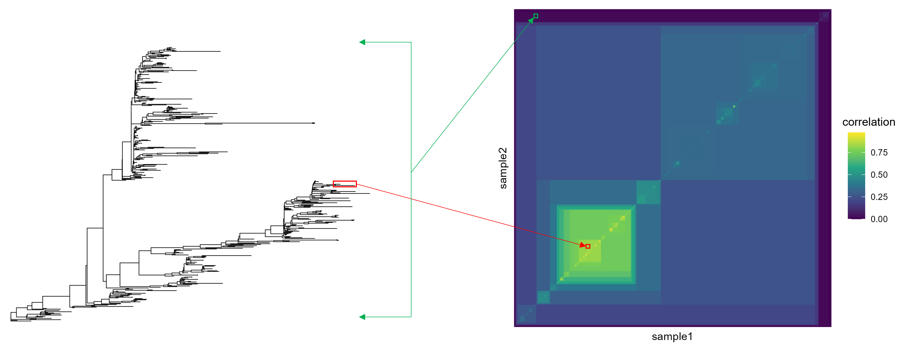

```{r, include = FALSE}
knitr::opts_chunk$set(
  collapse = TRUE,
  comment = "#>"
)
```

<style type="text/css">

body{ /* Normal  */
      font-size: 12px;
  }
td {  /* Table  */
  font-size: 8px;
}
h1.title {
  font-size: 38px;
}
h1 { /* Header 1 */
  font-size: 28px;
}
h2 { /* Header 2 */
    font-size: 22px;
}
h3 { /* Header 3 */
  font-size: 18px;
}
</style>

<!-- https://stackoverflow.com/questions/30446905/rmarkdown-font-size-and-header -->

# Introduction

It's difficult to find associations between microbial strains and host health outcomes due to their fine resolution and non-recurrence across individuals. This package, anpan, aims to make inferring those relationships a bit easier by providing an interface to our strain analysis functionality. This functionality covers three main points:

* Adaptive sample filtering of per-bug microbial gene profiles to identify and discard samples in which the bug is not present
* Modeling the association between outcome variables and microbial gene presence while accounting for covariates
* Modeling the association between outcome variables and the phylogeny of strains within a given microbial species

We'll cover the last point first in the section on phylogenetic generalized linear mixed models [PGLMMs].

# Libraries

We'll start by loading the library in this code chunk:

```{r}
library(anpan)
```

The startup message points out that you can easily parallelize / show progress bars for most long-running computations in `anpan` by setting `plan()` and `handlers()` after loading the `furrr` and `progressr` packages. For most users `plan(multisession, workers = 4)` and `handlers(global = TRUE)` are probably close to what you want, though both the parallelization strategy and progress reporting are highly customizable.

This code chunk loads some other packages we'll use:
```{r message = FALSE, warning=FALSE, class.source = "fold-show"}
library(ggplot2)
library(tibble)
library(dplyr)
library(ape)
```

# PGLMMs

Phylogenetic generalized linear mixed models (PGLMMs) are probabilistic models that account for phylogenetic structure. For a PGLMM with a simple linear regression as the base model, the model structure is as follows:

$$ y = X \beta + (1|\text{phylogeny}) + \epsilon $$
            
$$(1|\text{phylogeny}) \sim \text{MVNormal}(0, σ_p^2\Omega)$$

$$\epsilon \sim \text{Normal}(0, σ_R^2)$$

The outcome $y$ is modeled as a function of some familiar terms: covariates $X$, coefficients $\beta$, and residual noise $\epsilon$. The key addition is the phylogenetic term $(1|\text{phylogeny})$, which contains a "random effect" for each observation in $y$. Unlike typical random effects (which are usually independent between different levels of the random effect variable), the values in the phylogenetic term follow a pre-specified correlation structure $\Omega$, which is derived from a tree. The variability of the phylogenetic term is scaled by the "phylogenetic noise" parameter $\sigma_p$.

To understand how a tree implies a correlation structure, consider the plot below showing a phylogenetic tree and the correlation matrix it implies. First consider a pair of two leaves that are deeply branched from the root node and very close together (red highlight). If the phylogeny is truly impacting the outcome, this pair of leaves would would show high correlation with each other. Now imagine a pair of leaves that are on opposite ends of the tree, only very distantly connected to one another through the root node (green highlight). This pair would show low correlation. By numerically quantifying the "higher inter-leaf distance → lower correlation" principle, we can repeat this process for every possible pair of leaves to fill out $\Omega$.

```{r echo=FALSE}

```

## Simulate data

To demonstrate the PGLMM functionality, we'll simulate a tree, a single covariate `x`, and an outcome variable `y`. We'll use `n = 100`, `sigma_phylo = 1` and `sigma_resid = 1`. 

The code chunk below sets a randomization seed and the parameters we'll use, then generates a random tree:

```{r eval = TRUE}
set.seed(1234)

n = 100
sigma_phylo = 1
sigma_resid = 1

tr = ape::rtree(n)
```

You can try `plot(tr)` if you want to take a quick look at your tree, but we'll examine it with some additional detail later.

The chunk below derives the correlation matrix implied by the tree:
```{r}
cov_mat = ape::vcv.phylo(tr)
s       = sqrt(diag(cov_mat))
cor_mat = diag(1/s) %*% cov_mat %*% diag(1/s) 

rownames(cor_mat) = rownames(cov_mat)
colnames(cor_mat) = colnames(cov_mat)

cor_mat[1:5,1:5]
```

The "t#" labels are the default sample IDs that `ape::rtree()` puts as tip labels.


The chunk below generates a normally distributed covariate `covariate`, the true phylogenetic effects we'll use, and the outcome variable `outcome`, all stored in a tibble called `metadata`.
```{r}
covariate = rnorm(n)

true_phylo_effects = sigma_phylo * MASS::mvrnorm(1, mu = rep(0, n), Sigma = cor_mat)

metadata = tibble(sample_id = colnames(cov_mat),
                  covariate = covariate,
                  outcome   = true_phylo_effects +
                              rnorm(n, mean = 1 * covariate, sd = sigma_resid))

metadata
```

Now we have our tree and the metadata that goes along with it. We can use the function `anpan::plot_outcome_tree()` to show the tree with outcome as a dot on each leaf.

```{r fig.retina=3, out.width="120%"}
plot_outcome_tree(tr, metadata, 
                  covariates = NULL,
                  outcome    = "outcome")
```

You can sort of see by eye that the phylogeny impacts the outcome. The left side is generally a bit brighter, and close neighbors usually have about the same shade of color. (As a side note, the randomized tree name shows up because we didn't provide one and the function wasn't able to pull one from the tree input either). We can assess this pattern statistically with a PGLMM.

## Fit the PGLMM

The code chunk below shows how to use `anpan` to fit a PGLMM that examines this data for phylogenetic patterns while adjusting for our covariate. It will take a couple minutes to run. By default `anpan_pglmm` regularizes the noise ratio `sigma_phylo / sigma_resid` with a Gamma(1,2) prior and runs a leave-one-out model comparison against a "base" model that doesn't have the phylogenetic component. The default `family = "gaussian"` argument means the residual error is normally distributed. This can be changed to `family = "binomial"` with a binary outcome to run a phylogenetic logistic regression. 

```{r eval = TRUE, message=FALSE, results = "hide", warning=FALSE, out.width = "120%"}
result = anpan_pglmm(meta_file      = metadata,
                     tree_file      = tr,
                     outcome        = "outcome",
                     covariates     = "covariate",
                     family         = "gaussian",
                     bug_name       = "sim_bug",
                     reg_noise      = TRUE,
                     loo_comparison = TRUE,
                     refresh        = 500)
```

By default this command prints two plots (and a lot of console output with messages about the progression of the MCMC sampler). These plots show:

* The correlation matrix implied by the tree. This is how the PGLMM sees the correlation structure of the leaves.
* The same outcome tree as before, but now there's a lower panel showing the posterior predictive distribution for each leaf as a boxplot, overlaid with the true value. You can see that even though the phylogenetic predictive distributions are regularized a bit toward 0, they still generally capture the true values and the overall correlation structure.

If you want to tl;dr the rest of this section, look at the model comparison result to decide if the phylogeny is informative beyond the base model: 

```{r}
result$loo$comparison
```

The PGLMM is the best fitting model, and the difference in ELPD (i.e. predictive performance score) for the base model is more than two standard errors below zero. So in this case you can say the phylogeny clearly contributes to the outcome.

## Detailed interpretation

`result` is a list with five elements:

* `model_input` - the input metadata that made it into the analysis after taking the samples that overlapped with the leaves of the tree.
* `cor_mat` - the correlation matrix derived from the tree
* `pglmm_fit` - a [CmdStanMCMC](https://mc-stan.org/cmdstanr/reference/CmdStanMCMC.html) object containing the PGLMM fit
* `base_fit` - another [CmdStanMCMC](https://mc-stan.org/cmdstanr/reference/CmdStanMCMC.html) object containing the "base" GLM fit (without the phylogenetic component)
* `loo` - a list containing three elements: 
    * `pglmm_loo` - a [loo()](https://mc-stan.org/loo/) result for the PGLMM model using integrated importance weights
    * `base_loo` - a [loo()](https://mc-stan.org/loo/) result for the base model
    * `comparison` - a [loo_compare()](https://mc-stan.org/loo/reference/loo_compare.html) result comparing the two models by leave-one-out predictive performance.
    
The  `pglmm_fit` part of the result is the model fit produced by `cmdstanr` for the PGLMM. Any method applicable to [CmdStanMCMC objects](https://mc-stan.org/cmdstanr/reference/CmdStanMCMC.html) works on this, but of particular interest is the `summary()` method, which we demonstrate here to examine the posterior means for the covariate effects `beta`, the `intercept`, residual noise term `sigma_resid`, the spread of phylogenetic effects `sigma_phylo` and the per-leaf phylogenetic effects (which are indexed in the same order as `model_input`):

```{r}
post_summary = result$pglmm_fit$summary() |> 
  filter(grepl("beta|^intercept|sigma|^phylo_effect", variable)) |> 
  mutate(true_value = c(1,1,1, true_phylo_effects, 0))

post_summary

post_summary[-c(4:93),] |> 
  ggplot(aes(mean, variable)) + 
  geom_point() + 
  geom_segment(aes(x = q5, xend = q95,
                   y = variable, yend = variable)) + 
  geom_point(aes(x = true_value), 
             color = 'firebrick1',
             size = 3) + 
  labs(x = 'value',
       y = 'parameter',
       title = 'Posterior mean & 90% interval in black, true values in red') + 
  theme_light()
```

Most of the phylogenetic effects are cut from the plot for the sake of visibility. We can see that the posterior mean for beta is fairly close to the true value (1), as is the intercept (0) and noise terms. Importantly, the 90% posterior intervals capture the true values.


Let's look at the `pglmm_loo` result:

```{r}
result$loo$pglmm_loo
```

PGLMM models are very flexible because they have a parameter for every leaf. In some cases, this can cause the naive leave-one-out importance weights to be unstable. `anpan` generates importance weights for each observation by integrating the conditional likelihood for each observation at each posterior iteration as described in section 3.6.1 of @vehtari_glvm. This produces stable importance weights that we can use for model comparison. The `loo()` result provides some diagnostics that can help confirm that the importance weights are stable and we can trust the downstream model comparison. In this case, we get one Pareto k diagnostic value that is only "okay". If there are bad or "very bad" k values, that indicates that individual observations are having a strong effects on the model fit, and hence that the loo-based model comparison shouldn't be trusted. That scenario can happen more frequently without regularization when `reg_noise = FALSE`. We only got 1 non-good result, so in this case the model comparison should be fine.

Let's look at the model comparison:

```{r}
result$loo$comparison
```

`loo` prints the model with the best leave-one-out predictive performance on the first row, in this case the PGLMM fit. The difference in expected log pointwise predictive density (ELPD) compared to the other model is shown in the first column along with a standard error of the difference in the second column. Here the ELPD difference is about -14.7 with a SE around +/- 5. So in this we would conclude that the phylogenetic component of the PGLMM clearly fits better than the base linear model. Given that we simulated the tree with $\sigma_p \neq 0$, that is the correct conclusion.

There's a lot more to be said about loo model comparison that is beyond the scope of this vignette. You can read more interpretation of loo results on the [Cross-validation FAQ](https://avehtari.github.io/modelselection/CV-FAQ.html#11_What_is_the_interpretation_of_ELPD__elpd_loo__elpd_diff) written by the loo authors. 

# Element testing

This section isn't done.

```{r eval = FALSE}
anpan_batch()
```

# References

<div id="refs"></div>

# Session Info

```{r}
sessionInfo()
```


